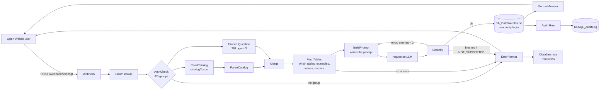

# Architecture

## Nodes that matter

Every Code node's source is `n8n_workflows/code/<node name>.js` (synced into the workflow JSON).

**Find Tables** (`Find Tables.js`) - decides *what* goes into the prompt; writes no prompt text.
1. `resolveAccess` - which catalogs/entities the user's AD groups allow.
2. `scoreEntities` - keyword score (Persian-normalised synonyms, names, columns) + semantic score
   (question vector vs table card and distinctive column vectors, top-3 column mean).
   `matchMetrics` - metric names in the question; their tables count as synonym matches.
   Confidence (`lowConfidence`) is decided here, before the next two bonuses.
   `matchValues` - stored values from `catalog/values.json` found in the question (exact, or a phrase inside values);
   their tables +3/+1. `patternBonus` - `patterns_fa` (Persian year/month -> `Dim_Date`).
3. `selectDomains` - at most 3 domains, each within 60% of the best one.
4. `selectEntities` - top tables + join closure (`from -> to`).
   `completeJoinPaths` - connects matched tables that are not joined directly through link tables (log `JOIN PATH`).
   `rankExamples` / `linkExampleTables` - examples from the catalogs and `query_bank.json`, most similar to the question
   first (embedding + shared words); an almost identical one (>= 0.85) brings its tables.
   Output: a plan - tables in order of importance, their joins, hints, examples, values, metrics.

**BuildPrompt** (`BuildPrompt.js`) - only *writes* the prompt from that plan; no catalog access.
`packPrompt` fits tables top-down into the 24 000-character budget (~8k Qwen tokens) and drops examples/values/metrics
whose tables did not fit; `renderPrompt` is the whole prompt text (rules + today's date in both calendars, hints,
METRICS, VALUES, up to 4 examples, DDL with sample values for small columns). To change the prompt wording, edit
`renderPrompt` only. The model answers UNDERSTOOD -> PLAN -> SQL.

**Other nodes**: `AuthCheck` (AD groups from LDAP), `Format Answer` (Markdown table + chart; `CHART_BASE_URL` at the
top), `ErrorFormat` (technical details only for `IT - Data` / `IT - Security`), `Build Fix Prompt` (one repair try),
`Audit Row` -> `Write Audit Log`, `Obsidian note` -> `Write note`.

**Security** (`n8n_workflows/code/Security.js`)
1. Extract SQL from the model reply (ignore Persian prose, keep `[...]`, `"..."`, `'...'`); the PLAN is returned
   as `plan` and shown as thinking, never read as SQL.
2. `NOT_SUPPORTED` -> polite message.
3. Read-only check: blocked keywords, no comma joins, single statement.
4. Force `TOP 200`.
5. Rewrite every table reference, qualified or not, to the user's entity CTE;
   unknown tables are rejected.
6. Prepend the CTEs, which expose only the allowed columns.

## Catalog contract
`domain`, `description_fa`, `shared`, `hints_fa`, `permissions` (AD group -> `*` or entity list),
`entities[]` (`name`, `kind`, `source`, `core`, `synonyms_fa`, `columns[]` with `exposed` / `review` / `alias`),
`joins[]` (FK `from` -> PK `to`), `examples[]`. Browse it in `Catalog/`.

## Why it works this way
- **Shared dimensions in `common.json`** (rhk_branch_04): the 7 dimensions used by several domains live once
  instead of in every catalog, so a fix is made in one place and the prompt has no duplicates.
  A shared table alone never activates a domain.
- **Domain routing** (rhk_branch_04): 6 catalogs / 152 tables do not fit one prompt, and unrelated tables confuse
  the model. So at most 3 domains (each ≥ 60% of the best) and a character budget (17 000, now 24 000 for Qwen 32B). It was 2 domains, but
  mixed questions lost the sales domain. A missing table is usually a missing synonym - fix the catalog, not the code.
- **Qualified names go through the CTEs** (rhk_branch_05): `[dbo].[Fact_Sales]` used to bypass the CTE, so an
  HR-only user could read sales, and 19 entity names equal older physical tables. Now every reference becomes the
  entity CTE or is rejected; a model CTE named like an entity is rejected too.
- **Join paths on the catalog graph** (rhk_branch_05): the closure only follows `from -> to` one step, so a
  link table (e.g. `Procurement_Fact_Inventory` between invoice state and delivery state) reached the prompt only
  if it matched a word. Now the shortest valid path between matched tables adds it (≤ 2 per path, ≤ 3 per
  question, only readable tables). Never through a dimension both sides only reference (`A -> D <- B`, fan trap).
  The graph comes from `joins` in the catalog - the same data Obsidian draws - not from the Obsidian notes.
- **Examples by similarity, only when their tables are in the prompt** (rhk_branch_05, step 3): fixed examples ignored the
  question (DAIL-SQL). An example whose tables the user cannot read would leak another domain's schema; one whose tables
  are not in the prompt makes the model reference tables Security rejects. Benchmark questions are never copied into
  the bank (a test checks it), so the benchmark still measures generalisation.
- **Values are looked up, not guessed** (step 2): a value written differently from the database returns an empty result
  with no error. Value matches raise table scores but not the confidence: «هوای تهران» must still look unanswerable.
  `values.json` is real data, so it is built on the server and never committed.
- **Metrics are definitions, not hints** (step 5): «فروش خالص» has one correct formula with a mandatory filter; the model
  gets it word for word. A metric counts like a synonym of its tables (a floor, not an extra bonus) - adding it on top
  of the synonym it repeats pushed sales out of a mixed sales + purchase question.
- **Dim_Date is shared** (step 5): every domain asks for Persian years and months; HR/BOM/inventory users get only this
  table from `common.json` (entity-level permission). Its join is a date expression, so it is a scoped hint, not a `joins` entry.
- **Two nodes: Find Tables + BuildPrompt** (rhk_branch_05): one 1 000-line node did both the search and the prompt
  text. Split so each has one job, the prompt wording can be changed without touching the search, and n8n's
  Executions show the plan (chosen tables) separately from the prompt. Only the small plan passes between them, never
  embedding vectors. Verified: identical prompts before and after on 160 question/vector combinations.
- **PLAN before SQL** (step 6, DIN-SQL / CHASE-SQL): three short lines; Security accepts only a line-start `SQL:` label
  so plan text with "with"/"select" in it is never executed.
- **What is embedded** (rhk_branch_05): one card per table + one vector per *distinctive* column (keys and
  descriptions repeated in 3+ tables get none); a table's column score is the mean of its top 3 columns.
  Fewer, cleaner vectors: 1 470 -> 571, sidecars 13 MB -> 4.8 MB.
