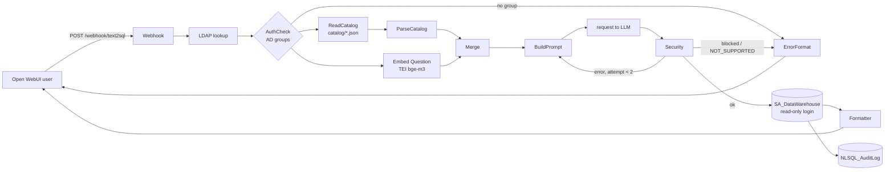

# Architecture

## Nodes that matter

**BuildPrompt** (`n8n_workflows/code/BuildPrompt.js`)
1. `resolveAccess` - which catalogs/entities the user's AD groups allow.
2. `scoreEntities` - keyword score (Persian-normalised synonyms, names, columns) + semantic score
   (question vector vs table card and distinctive column vectors, top-3 column mean).
3. `selectDomains` - at most 3 domains, each within 60% of the best one ([[ADR-002 Domain routing in BuildPrompt]]).
4. `selectEntities` - top tables + join closure (`from -> to`).
5. `renderPrompt` / `packPrompt` - DDL, hints, examples within a 17 000-character budget.

**Security** (`n8n_workflows/code/Security.js`)
1. Extract SQL from the model reply (ignore Persian prose, keep `[...]`, `"..."`, `'...'`).
2. `NOT_SUPPORTED` -> polite message.
3. Read-only check: blocked keywords, no comma joins, single statement.
4. Force `TOP 200`.
5. Rewrite every table reference, qualified or not, to the user's entity CTE
   ([[ADR-003 Qualified names resolve to entity CTEs]]); unknown tables are rejected.
6. Prepend the CTEs, which expose only the allowed columns.

## Catalog contract
`domain`, `description_fa`, `shared`, `hints_fa`, `permissions` (AD group -> `*` or entity list),
`entities[]` (`name`, `kind`, `source`, `core`, `synonyms_fa`, `columns[]` with `exposed` / `review` / `alias`),
`joins[]` (FK `from` -> PK `to`), `examples[]`. Browse it in `Catalog/`.
